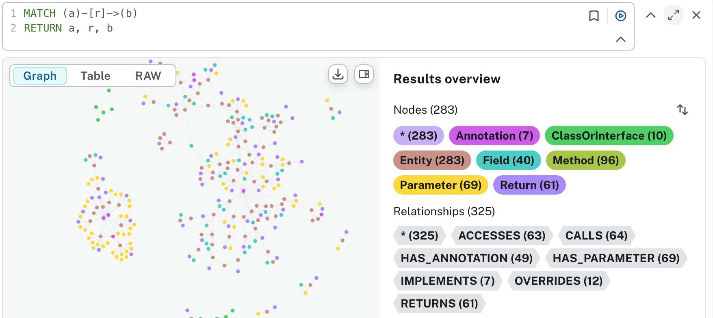

# Java ERE Service

一个使用 JavaParser 分析 Java 项目源码，进行 ERE (Entity-Relationship-Extraction) 关系提取和从git diff的原始输出中提取出实体变更信息&从neo4j查询调用链上下游并进行格式化输出的项目，是构建基于 Java 源码的知识图谱的原始数据（实体、关系）来源。

## 一、com.java.ere
### 功能特性

- ✅ **单文件分析**：支持分析单个 Java 源文件
- ✅ **批量分析**：支持目录递归扫描和批量分析
- ✅ **灵活过滤**：基于 Glob 模式的强大过滤规则
- ✅ **符号解析**：准确解析类型引用和方法调用
- ✅ **第三方库处理**：智能处理第三方库依赖，保持图谱简洁
- ✅ **Spring Boot 优化**：针对 Maven Spring Boot 项目优化

### 目前支持的实体&关系类型
见 [entity_relationship_analyze.md](docs/entity_relationship_analyze.md)

### 实体&类型的数据结构说明
见 [entity_relationship_data_structure_example.json](docs/entity_relationship_data_structure_example.json)

### 如何开始分析单个文件

```bash
mvn compile exec:java -Dexec.mainClass="com.java.ere.entry.LocalDebugMain"
```

### 如何开始分析整个项目
#### 1. 根据需求修改配置文件
项目的配置文件是`analysis-config.yml`
#### 2. 生成抽取实体和关系的json文件

```bash
mvn compile exec:java -Dexec.mainClass="com.java.ere.entry.ConfigFileMain" -Dexec.args="analysis-config.yml"
```

命令会读取`analysis-config.yml`（如需其他配置文件可替换路径），并在`extract_out/`目录下生成带时间戳的`analysis-result_*.json`文件。

#### 3. 根据生成的json文件生成cyper脚本

```bash
mvn compile exec:java -Dexec.mainClass="com.java.ere.entry.ExportToNeo4jMain" \
  -Dexec.args="extract_out/analysis-result_demo_20250101_120000.json extract_out/neo4j-import.cypher"
```

不传参数时程序会自动选择`extract_out/`目录中最新的结果文件；如需指定输入/输出，可替换命令中的JSON路径与Cypher输出路径。

#### 4. 将cyper脚本导入到Neo4j数据库
  复制cyper脚本中全部内容，然后在neo4j browser中执行
  或
  使用`docs/neo4j-import-script.sh`脚本导入


#### 5. 根据你想要查询的实体和关系，使用Cypher查询语言进行查询, 如查询所有实体间的关系


## 二、com.java.extractor
### 功能特性

- ✅ **从git diff的原始输出中提取出实体变更信息**
- ✅ **覆盖的实体类型有Field、Method、ClassOrInterface**
- ✅ **覆盖的实体变更场景有：**
    1️⃣ **ClassOrInterface（类/接口）**
    - ✅ **ADD**: 新增类/接口声明
    - ✅ **DELETE**: 删除类/接口声明
    - ✅ **MODIFY**: 修改类/接口声明（继承、实现、修饰符等）
    - ✅ **DELETE（文件删除）**: 整个文件被删除时（`+++ /dev/null`）
    - ✅ **MODIFY（类体变更）**: 类声明未变但类体内有变更

    2️⃣ **Field（字段）**
    - ✅ **ADD**: 新增字段声明
    - ✅ **DELETE**: 删除字段声明
    - ✅ **MODIFY**: 字段声明修改（包括类型、修饰符、**初始化值**等）
    - ✅ **枚举常量**: 支持枚举常量的变更检测
    - ✅ **常量字段**: 支持 `static final` 常量的检测

    3️⃣ **Method（方法）**
    - ✅ **ADD**: 新增方法声明
    - ✅ **DELETE**: 删除方法声明
    - ✅ **MODIFY（声明变更）**: 方法签名、返回类型、修饰符等修改
    - ✅ **MODIFY（方法体变更）**: 方法声明未变但方法体内有变更
      - 基于源文件 + JavaParser 定位变更所在方法
      - 检测方法体内的逻辑变更

    ❌ **未覆盖的实体类型（3种）**
    4️⃣ **Parameter（参数）**
    - ❌ 参数的新增/删除/修改
    - 💡 说明：目前方法签名变更会触发 Method 的 MODIFY，但不会单独提取参数级别的变更

    5️⃣ **Return（返回值）**
    - ❌ 返回类型的独立变更检测
    - 💡 说明：返回类型变更会触发 Method 的 MODIFY，但不会作为独立的 Return 实体

    6️⃣ **Exception（异常）**
    - ❌ throws 子句的新增/删除/修改
    - 💡 说明：异常声明变更会触发 Method 的 MODIFY，但不会作为独立的 Exception 实体

    📋 特殊场景覆盖
    ### ✅ **已支持**
    1. **文件删除** - `+++ /dev/null` → ClassOrInterface DELETE
    2. **字段值修改** - 字段初始化值变化 → Field MODIFY
    3. **方法体变更** - 方法内部逻辑变化 → Method MODIFY
    4. **类体变更** - 类内部成员变化 → ClassOrInterface MODIFY
    5. **枚举值变更** - 枚举常量参数变化 → Field MODIFY

    ### ⚠️ **部分支持**
    - **内部类/嵌套类** - 会被检测但可能作为独立的 ClassOrInterface
    - **Lambda 表达式** - 作为方法体变更的一部分
    - **匿名内部类** - 作为方法体变更的一部分
### 执行步骤
第1步：解析git diff原始输出内容，生成 generated_input.json

```bash
mvn exec:java -Dexec.mainClass="com.java.extractor.cli.ExtractorCLI" \
  -Dexec.args="parse-diff \
    --diff git_diff_original.txt \
    --project /Users/zhangxiaoguo/Downloads/java-callgraph2 \
    --output generated_input.json \
    --neo4j-uri bolt://localhost:7687 \
    --neo4j-user neo4j \
    --neo4j-password test654321"
```

第2步：根据generated_input.json变更信息，向neo4j查询每个变更实体的调用链上下游信息，生成output.json

```bash
mvn exec:java -Dexec.mainClass="com.java.extractor.cli.ExtractorCLI" \
  -Dexec.args="query-calls \
    --input generated_input.json \
    --output output.json \
    --neo4j-uri bolt://localhost:7687 \
    --neo4j-user neo4j \
    --neo4j-password your_password"
```
